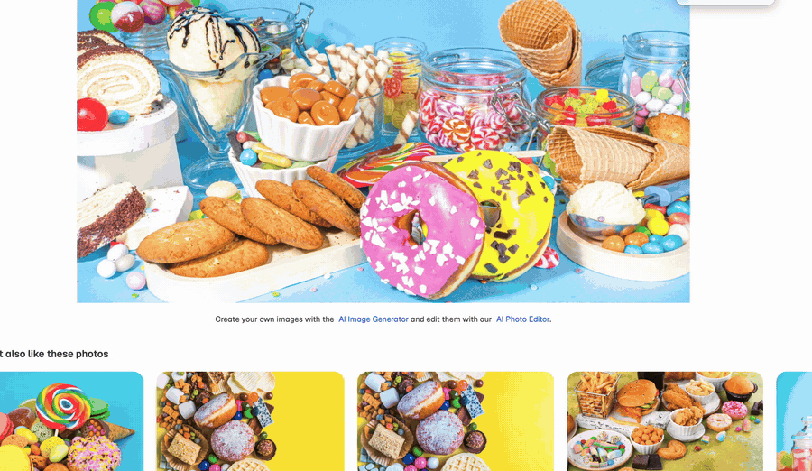
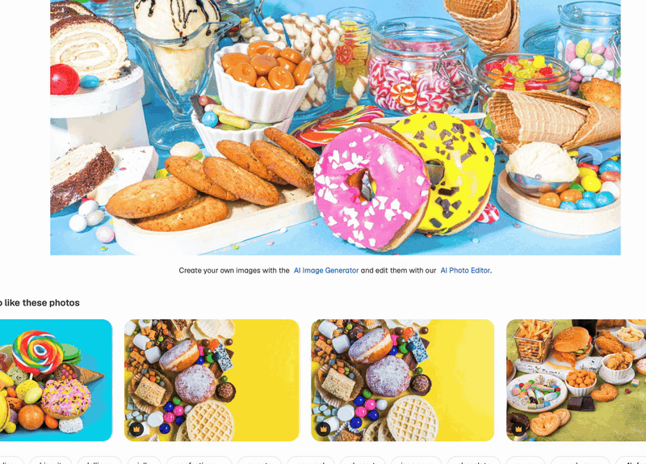

# Socorin

*[English](README.md) · Tiếng Việt*

[](https://github.com/huystr/socorin/actions/workflows/ci.yml)
[](LICENSE)

Công cụ chụp và chú thích ảnh màn hình gọn nhẹ, chạy đa nền tảng (macOS,
Windows, Linux). App nằm trên menu bar / khay hệ thống, gọi bằng phím tắt
toàn cục, cho phép kéo chọn vùng trên bất kỳ màn hình nào rồi chú thích bằng
mũi tên, khung chữ nhật, ellipse, đường thẳng, nét vẽ tay, chữ, highlight,
đánh số thứ tự và làm mờ (pixelate).



Quay một vùng màn hình cũng theo cách đó: kéo chọn, quay, *Stop & copy*, rồi dán
video vào cuộc trò chuyện.



Xây dựng bằng [Tauri v2](https://tauri.app) (lõi Rust) và React + TypeScript
(giao diện, [Konva](https://konvajs.org) cho canvas chú thích).

## Tải về

Bộ cài cho macOS (`.dmg` universal), Windows (`.exe` x64) và Linux (`.deb`,
`.AppImage`) có tại <https://socorin.com>, kèm checksum SHA-256 ở
`https://socorin.com/downloads/SHA256SUMS.txt`. Bản đã cài tự kiểm tra
phiên bản mới ở đó mỗi ngày một lần.

## Tính năng

- Phím tắt toàn cục (mặc định `Cmd/Ctrl+Shift+A`) để chụp vùng, phím tắt thứ
  hai tuỳ chọn để chụp toàn màn hình. Cả hai đều đổi được.
- Overlay chọn vùng hỗ trợ nhiều màn hình và HiDPI.
- Editor chú thích: chọn/di chuyển/đổi kích thước, khung chữ nhật, ellipse,
  mũi tên, đường thẳng, bút, chữ, highlight, đánh số, pixelate; bộ màu và độ
  dày nét có sẵn; undo/redo; zoom.
- Sao chép vào clipboard, lưu nhanh vào thư mục với tên theo thời gian, hoặc
  Save as.
- *Upload & copy link*: một cú bấm (hoặc `Ctrl/⌘+Shift+U`) trên thanh công cụ
  chú thích sẽ tải ảnh (đã kèm chú thích) lên socorin.com và đưa link chia sẻ
  vào clipboard, kèm một thông báo nhỏ ngay dưới icon trên menu bar / khay
  (Copy again / Delete from server). File được giữ 60 ngày, tối đa 15 MB trên
  socorin.com; bản thân Socorin không bao giờ tải lên quá 25 MB, dù server
  cho phép bao nhiêu. Link được sao chép bắt buộc phải nằm trên đúng server
  đã nhận ảnh — câu trả lời trỏ đi nơi khác sẽ bị từ chối và không có gì vào
  clipboard. *Settings → Share* liệt kê các link đã tạo, mỗi link có *Copy*
  và *Delete* (link hết hạn tự rời khỏi danh sách), và cho phép đổi sang
  server upload khác (server tự dựng, hoặc `http://localhost:3000` khi phát
  triển).
- Chế độ "sau khi chụp": mở editor, sao chép ngay, lưu ngay, hoặc tải lên và
  sao chép link ngay.
- Ghi hình một vùng hoặc toàn màn hình (menu khay, phím tắt, dòng lệnh).
  Ghi một vùng: thanh điều khiển nổi nằm đúng chỗ thanh Record / Cancel trước
  đó, hiện thời gian đã ghi cùng *Stop & copy* (video được đưa vào clipboard
  dưới dạng file, dán thẳng vào chat), *Stop & upload* (video được tải lên
  socorin.com và link vào clipboard, cùng giới hạn như ảnh), *Stop* (mở thư
  mục chứa file) và *Cancel* (bỏ bản ghi). Ghi toàn màn hình không hiện
  thanh nào: icon trên khay chuyển sang màu đỏ kèm thời gian đã ghi, menu
  của nó có đúng bốn thao tác trên. macOS ghi bằng `screencapture`, Windows
  bằng bộ ghi tích hợp (Windows Graphics Capture + Media Foundation, không
  cần cài thêm gì), Linux bằng `ffmpeg`. macOS ghi ra file QuickTime `.mov`
  mà server chia sẻ không nhận: nếu máy có `ffmpeg` (`brew install ffmpeg`,
  hoặc chỉ đường dẫn trong *Settings → Recording*) thì *Stop & upload* sẽ
  chuyển sang `.mp4` trước (không mã hoá lại); không có thì app giữ nguyên
  file `.mov` và báo rõ.
- Khởi động cùng máy (bật sẵn; tắt trong Settings nếu không muốn), chỉ chạy
  một phiên bản, cửa sổ cài đặt ẩn trong khay.
- Kiểm tra phiên bản mới mỗi ngày một lần qua
  `https://socorin.com/version.json` (bật sẵn; tắt trong mục *Updates* của
  Settings). Có bản mới thì hiện một thông báo nhỏ ngay dưới icon trên menu
  bar / khay (Update now / Later), thêm dòng *Update to Socorin x.y.z…* ở đầu
  menu của icon và trong Settings (có cả nút *Check now*). *Install updates
  automatically* (tắt sẵn) sẽ tải và cài ngay khi phát hiện rồi tự khởi động
  lại app. Việc cài đi qua updater của Tauri: manifest nêu bộ cài đã ký cho
  từng nền tảng (macOS `.app.tar.gz`, Windows NSIS `.exe`, Linux `.AppImage`;
  người dùng `.deb` được đưa tới trang tải về) và app chỉ chấp nhận file có
  chữ ký khớp với khoá công khai gắn sẵn trong app.
- Cờ dòng lệnh để gán phím tắt từ môi trường desktop: `--capture`,
  `--capture-full`, `--capture-all` (chọn vùng có thể vắt qua nhiều màn hình), `--record`,
  `--record-full`, `--stop-record`, `--cancel`.
  Các cờ chụp và ghi hình bị bỏ qua cho tới khi bật *Allow command-line
  triggers* trong Settings (nếu không, bất kỳ chương trình nào trên máy cũng có
  thể mượn app này, vốn đã có quyền ghi màn hình, để chụp hộ).

## Quyền riêng tư

Không có gì rời khỏi máy nếu bạn không yêu cầu. Ảnh chụp và video nằm trên
đĩa và trong clipboard của bạn; app chỉ ra mạng khi kiểm tra phiên bản mỗi
ngày (một lệnh `GET` tới `version.json`, tắt được) và khi chính bạn bấm
*Upload & copy link*, *Stop & upload* hoặc chọn chế độ *upload* sau khi
chụp. Mỗi lần tải lên gửi file, loại và kích thước file, checksum, phiên bản
và hệ điều hành của app tới server ghi trong *Settings → Share*, kèm một
install ID ngẫu nhiên do server cấp ở lần đầu để chống spam: không có tài
khoản, và *Reset install ID* sẽ bỏ ID đó. Mỗi link đi kèm một delete token
được app giữ cục bộ, nên bạn có thể gỡ file khỏi server từ thông báo hoặc
từ *Settings → Share* trước khi nó hết hạn.

## Phát triển

Yêu cầu:

- Node.js 20+ và npm
- Rust stable (`curl https://sh.rustup.rs -sSf | sh`)
- Bộ công cụ theo nền tảng, xem <https://tauri.app/start/prerequisites/>
  - macOS: Xcode Command Line Tools
  - Windows: Visual Studio Build Tools (C++), WebView2 (Win 11 có sẵn)
  - Ubuntu 22.04+:
    `sudo apt install libwebkit2gtk-4.1-dev build-essential curl wget file libxdo-dev libssl-dev libayatana-appindicator3-dev librsvg2-dev libpipewire-0.3-dev libdbus-1-dev libxcb1-dev libxcb-randr0-dev`

```bash
npm install
npm run tauri dev
```

Build bộ cài cho đúng máy đang dùng:

```bash
npm run tauri build
```

Cross-build từ máy Mac (kết quả nằm trong `installers/`):

```bash
scripts/build-macos.sh                                    # macOS .dmg universal, ký + notarize khi có .env.apple
scripts/build-windows.sh                                  # Windows x64 .exe (NSIS) qua cargo-xwin
scripts/build-linux.sh                                    # Ubuntu x86_64 .deb + .AppImage qua Docker
scripts/build-linux.sh arm64                              # Ubuntu aarch64
```

Bộ cài Windows và Linux build theo cách này đã được chạy trên máy thật và
hoạt động tốt. Tuy vậy máy Mac dùng để build không chạy thử được chúng, nên
mỗi bản build mới vẫn cần chạy nhanh một lần trên hệ điều hành đích trước khi
phát hành. Script Linux ghi `SHA256SUMS-linux.txt` cạnh các gói; hãy công bố
checksum cùng bộ cài. Các image Docker pin Node và rustup theo phiên bản và SHA-256, bước dự
phòng AppImage cũng pin các file `linuxdeploy` tải về như vậy;
`scripts/makensis-docker` chỉ mount thư mục dự án và cache của Tauri vào
container NSIS. Container này build bản NSIS chính thức từ source và stub đã
pin thay vì cài gói `nsis` của Ubuntu: stub build bằng MinGW của bản phân
phối để lại relocation directory trỏ sai chỗ, các trình đọc PE và engine
diệt virus báo là file hỏng (corrupt).

### Ký và notarize bản macOS

Bản build thường chỉ được ký ad-hoc: trên máy Mac khác, Gatekeeper báo không
xác minh được app và người dùng phải cho phép thủ công trong *System Settings →
Privacy & Security*. Muốn phát hành không cảnh báo, app phải được ký bằng chứng
chỉ **Developer ID Application** (Apple Developer Program trả phí) và được Apple
notarize. `scripts/build-macos.sh` làm cả hai việc qua Tauri CLI:

1. **Chứng chỉ.** Keychain Access → *Certificate Assistant → Request a
   Certificate From a Certificate Authority…* (lưu ra đĩa). Vào
   [developer.apple.com/account/resources/certificates](https://developer.apple.com/account/resources/certificates)
   tạo chứng chỉ *Developer ID Application* từ file yêu cầu đó, tải `.cer` về
   và nhấp đúp. Lệnh `security find-identity -v -p codesigning` phải liệt kê
   `Developer ID Application: <tên> (<TEAMID>)` ở trạng thái valid (nếu báo
   không tin cậy, cài chứng chỉ trung gian *Developer ID G2* từ
   [apple.com/certificateauthority](https://www.apple.com/certificateauthority/)).
2. **Thông tin notarize.** Hoặc API key App Store Connect (*Users and Access →
   Integrations → App Store Connect API → Team Keys*, vai trò Developer; tải
   file `.p8` và để ngoài repository), hoặc Apple ID kèm app-specific password
   lưu vào keychain một lần bằng
   `xcrun notarytool store-credentials <tên> --apple-id <email> --team-id <TEAMID>`
   (gõ mật khẩu tại dấu nhắc) rồi khai `APPLE_KEYCHAIN_PROFILE=<tên>`.
   `APPLE_ID` / `APPLE_PASSWORD` trong môi trường bị từ chối: Tauri CLI sẽ đưa
   mật khẩu đó lên dòng lệnh `notarytool`, tiến trình nào trên máy cũng đọc được.
3. Chép `.env.apple.example` thành `.env.apple` (đã git-ignore) và điền vào.
4. Chạy `scripts/build-macos.sh` (hoặc thêm `aarch64` / `x86_64` để build một
   kiến trúc). Frontend và cargo build chạy trước, chưa nạp thông tin đăng
   nhập; chỉ bước đóng gói của Tauri CLI mới thấy chúng. Tauri ký app với
   hardened runtime, gửi lên Apple, staple ticket và ký `.dmg`; script
   notarize và staple thêm `.dmg`, in kết quả kiểm tra `spctl` / `stapler`
   (mong đợi `accepted source=Notarized Developer ID`) và ghi file `.sha256`
   cạnh bộ cài. Notarize thường mất một đến năm phút.

Với keychain profile, Tauri chỉ ký; script gửi file `.dmg` lên Apple (notarize
luôn app bên trong) rồi staple `.dmg` và bản `.app` trong thư mục build. Bản
`.app` nằm trong `.dmg` không có staple, Gatekeeper kiểm tra online khi mở lần
đầu.

Các biến `APPLE_*` này dùng được trên CI: xuất chứng chỉ ra `.p12`, đặt vào
`APPLE_CERTIFICATE` (base64) cùng `APPLE_CERTIFICATE_PASSWORD` thay vì dựa vào
keychain. Bản đã ký có danh tính ổn định nên quyền Screen Recording không bị
mất sau mỗi lần cập nhật.

### Ký số bản Windows

Tauri chạy `scripts/windows-sign.sh` với app, bộ cài, uninstaller và plugin
NSIS (`bundle.windows.signCommand`). Khi chưa có chứng chỉ, script chỉ điền
checksum trong header PE mà lld-link và makensis đều bỏ trống; bản build vẫn
chưa ký, nên SmartScreen sẽ cảnh báo và các engine diệt virus dùng máy học
vẫn có thể gắn cờ (bộ cài mới tinh, chưa ký, dùng API chụp màn hình, phím
tắt toàn cục và clipboard trùng với hồ sơ spyware của họ). Để ký: mua chứng
chỉ code-signing OV hoặc EV dạng `.pfx`, chép `.env.windows.example` thành
`.env.windows` (đã git-ignore), điền `WINDOWS_SIGN_PFX` và
`WINDOWS_SIGN_PASSWORD`, cài `osslsigncode` (`brew install osslsigncode`) rồi
chạy lại `scripts/build-windows.sh`; `scripts/makensis-docker` chuyển chứng
chỉ vào container cho bước uninstaller. Đường ký này đã nối sẵn nhưng chưa
được chạy thử với chứng chỉ thật.

### Ký bản cập nhật

Updater trong app kiểm tra mọi file tải về bằng khoá công khai trong
`src-tauri/tauri.conf.json` (`plugins.updater.pubkey`); khoá riêng tương ứng
ký các artifact cập nhật lúc build (`bundle.createUpdaterArtifacts`). Cặp
khoá được tạo bằng `tauri signer generate -w ~/.tauri/socorin.key` (không
mật khẩu); chép `.env.updater.example` thành `.env.updater` (đã git-ignore)
và trỏ `TAURI_SIGNING_PRIVATE_KEY` tới file khoá. Cả ba script build đều
đọc nó: script macOS chép `Socorin_<v>_universal.app.tar.gz` cùng `.sig`
cạnh file `.dmg`, script Windows chép `.sig` của bộ cài, script Linux chép
`.sig` của AppImage (bước fallback tự ký khi bundler không chạy tới bước
AppImage). Thiếu khoá thì vẫn build được nhưng không có gì được ký và
updater không cài được.

Mất khoá riêng đồng nghĩa không bản đã cài nào tự cập nhật được nữa; hãy
sao lưu nó. Quy trình ra bản phát hành và đưa lên socorin.com được mô tả
trong [docs/RELEASING.md](docs/RELEASING.md) (tiếng Anh).

### Kiểm thử không cần chuột

Có hai công cụ hỗ trợ để chạy tự động toàn bộ luồng:

- **Mock trình duyệt** (`src/devmock.ts`): khi `npm run dev` đang chạy, mở
  `http://localhost:1420/?mock=overlay-1`, `?mock=editor` hoặc `?mock=main`
  trong trình duyệt thường. Runtime Tauri được thay bằng stub trong trang với
  ảnh chụp giả, nên có thể thao tác và kiểm tra overlay, editor, settings bằng
  công cụ trình duyệt thông thường.
- **Harness end-to-end** (`src-tauri/src/debug.rs`), bật bằng biến môi trường:

  ```bash
  SOCORIN_DEBUG=1 \
  SOCORIN_DEBUG_DIR=/tmp/socorin-dump \
  SOCORIN_DEBUG_AUTOSELECT=200,150,900,600 \
  SOCORIN_DEBUG_AUTOACTION=save \
  npm run tauri dev
  ```

  Sau đó kích hoạt chụp (`target/debug/socorin --capture` từ shell thứ
  hai sau khi bật *Allow command-line triggers*, menu khay hoặc phím tắt).
  Overlay tự chọn vùng, editor tự thêm mỗi loại chú thích một cái rồi lưu vào
  thư mục ảnh; ảnh từng màn hình và ảnh crop được ghi ra `SOCORIN_DEBUG_DIR`.

  Bản release chỉ giữ lại `SOCORIN_DEBUG` (ghi log). Các biến còn lại bị
  loại khỏi mã khi biên dịch, trừ khi build bằng
  `npm run tauri build -- --features debug-harness`, nên file phát hành không
  thể bị điều khiển qua biến môi trường.

## Ghi chú theo nền tảng

- **macOS** cần quyền Screen Recording (System Settings → Privacy &
  Security → Screen Recording). App sẽ hỏi lần đầu; nếu sau khi cấp mà ảnh
  chụp vẫn trống, hãy khởi động lại app.
- **macOS: cài vào Applications trước.** Chạy từ file `.dmg` đang mount (hoặc
  từ bản sao translocation của Gatekeeper) thì app không thể được cấp quyền
  Screen Recording; macOS thường không hiện hộp thoại và app không xuất hiện
  trong danh sách. Cửa sổ Settings có nhắc điều này. Kéo `Socorin.app` vào
  Applications, eject ổ đĩa ảo rồi mở từ đó.
- **macOS: bản ký ad-hoc** (không có Developer ID, xem mục *Ký và notarize*
  ở trên) được nhận diện bằng hash của đúng file binary, nên sau mỗi lần cập
  nhật mục quyền cũ bị lệch: công tắc vẫn bật nhưng chụp thất bại, hoặc app
  biến mất khỏi danh sách. Đặt lại rồi cấp lại:
  `tccutil reset ScreenCapture com.socorin`.
- **Linux**: crate chụp màn hình `xcap` bind với header pipewire 1.x, nên
  bản build Linux (và file `.deb`/`.AppImage` tạo ra) nhắm tới Ubuntu 24.04
  trở lên; 22.04 dùng pipewire 0.3.48 nên không biên dịch được.
- **Linux / Wayland** (mặc định trên Ubuntu từ 22.04): compositor không cho
  app đăng ký phím tắt toàn cục. Hãy gán phím tắt tuỳ chỉnh trong *Settings →
  Keyboard* cho lệnh `socorin --capture` và bật *Allow command-line
  triggers* trong cài đặt của app; phiên bản đang chạy sẽ nhận lệnh.
  Việc chụp màn hình đi qua D-Bus của GNOME Shell hoặc xdg-desktop-portal,
  do `xcap` xử lý. Ghi hình đi qua portal ScreenCast và GStreamer
  (`gstreamer1.0-tools`, `-pipewire`, `-plugins-good`, `-plugins-ugly`,
  `-libav`): luôn ghi trọn một màn hình. Record mở hộp thoại chọn màn hình
  của hệ thống mỗi lần, Record Full Screen ghi nhớ màn hình sau lần đầu; ghi
  một vùng vẫn cần X11. Với nhiều màn hình, mỗi overlay được đặt
  fullscreen trên đúng màn hình của nó vì Wayland bỏ qua vị trí cửa sổ. Trên
  X11 mọi thứ chạy native.
- **Windows**: không cần cài đặt gì thêm. DPI theo từng màn hình với tỉ lệ
  khác nhau được xử lý bằng cách quy đổi hình học màn hình về đơn vị logical.
- **Ghi hình trên Windows / Linux** dùng `ffmpeg`. App tìm nó ở các vị trí cài
  đặt thông dụng rồi tới các mục tuyệt đối trong `PATH` (không bao giờ dùng thư
  mục làm việc); *Settings → Recording* cho phép nhập đường dẫn cụ thể nếu nó
  nằm chỗ khác (phải là chính file `ffmpeg`: thiết lập này không thể trỏ trình
  ghi hình sang chương trình khác). macOS ghi hình bằng `screencapture` của hệ
  thống.

## Đóng góp

Hoan nghênh báo lỗi và pull request; [CONTRIBUTING.md](CONTRIBUTING.md) nêu
quy tắc kiểm thử và coverage mà mọi thay đổi phải đạt. Vấn đề bảo mật gửi
theo [SECURITY.md](SECURITY.md), không qua issue công khai.

## Giấy phép

Socorin phát hành theo [Apache License 2.0](LICENSE). Đóng góp được tiếp
nhận theo cùng điều khoản (điều 5 của giấy phép).
